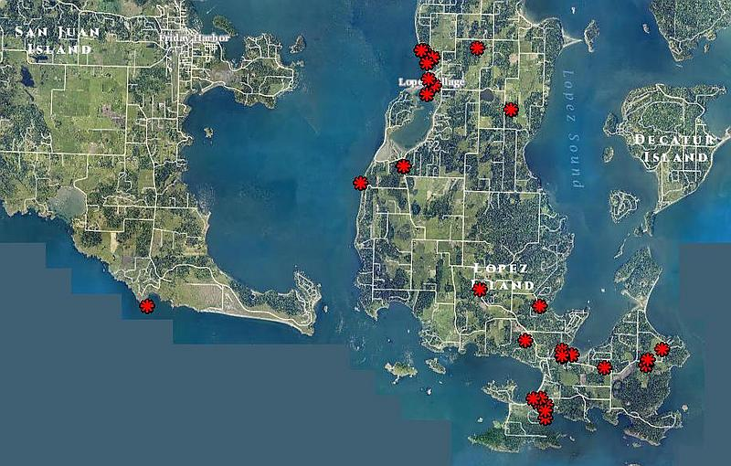

## San Juan County Jet Noise
   May 8, 2014 - September 30, 2014

   October 7, 2014

---

## A Little Background

* Ault Field = NAS Whidbey Main Base

* OLF = Coupeville practice runway

  
  *(down)*

--

## May 2013

   Council members Jarman and Stephens visit base to reopen communications

   Result - Better communications concerning operations at OLF

--

## December 2013

   Council members attend Environmental Impact Statement Open Houses concerning the "Growlers" in Oak Harbor and Anacortes

--

## April 2014

   Delegation of Council, County staff, Town of Friday Harbor staff, former commissioner, and citizens meet with the base commander

   Result - They would accept and analyze data collected by the county

--

## May 2014

   San Juan County Jet Noise complaint web site launched

--

## July 2014

  Sent small sample of data to the Navy and Congressional delegation

--

## September 2014

   Received letter of acknowledgement

   Received second letter analyzing our data 

---

## 871 Total Reports

## 206 Unique Reports

---

<iframe width="940" height="600" frameborder="0" scrolling="no" marginheight="0" marginwidth="0" src="http://sjcgis.maps.arcgis.com/home/webmap/templates/OnePane/basicviewer/embed.html?webmap=fe90539af97140a28ddf2271ddcf2392&amp;gcsextent=-123.3407,48.3698,-122.4735,48.8071&amp;home=true&amp;displayslider=true&amp;displaybasemaps=true"></iframe> <small><a href="http://sjcgis.maps.arcgis.com/home/webmap/viewer.html?webmap=fe90539af97140a28ddf2271ddcf2392&amp;extent=-123.3407,48.3698,-122.4735,48.8071" style="color:#0000FF;text-align:left" target="_blank">View larger map</a></small>

Use your mouse wheel to zoom in or out. Click on a dot to see details.

---

## Reports by Island
   

---

## Reports by Time of Day 
   

---

## Reports by Date
   

---

## Reports by Loudness
   

---

## 33 Reports Of Seeing Jets
   Many comments suggested clouds or night sky limited visibility

   *(map below)*
   

--

## Reported Jet Sightings
   

---

#### Complaint Fatigue, Lost Sleep, Disrupted Events and now flights are affecting our Economy and Property Values

   *"We live in Portland, Oregon so are not directly affected. However, we vacation in the San Juans every year precisely because of the calm, quiet and pristine environment. Any future plans to purchase real estate there would depend on the future outcome of this issue. Thank you."* - Tom Kubisiak

---

## What can be done?

*(down)*

--

### Conduct actual noise testing in islands during operations

--

### Navy communicate planned operations at Ault field

--

### Require all flight ops to fly Instrument Flight Rules (IFR) patterns both coming and going

--

### Restrict flights over Islands

--

### Use our data to improve operations and relations with Islands

--

### Congress require quieter engines. 

  A 747 jetliner is more powerful and quieter than a Growler. GE makes engines for both.

---

## Thanks

